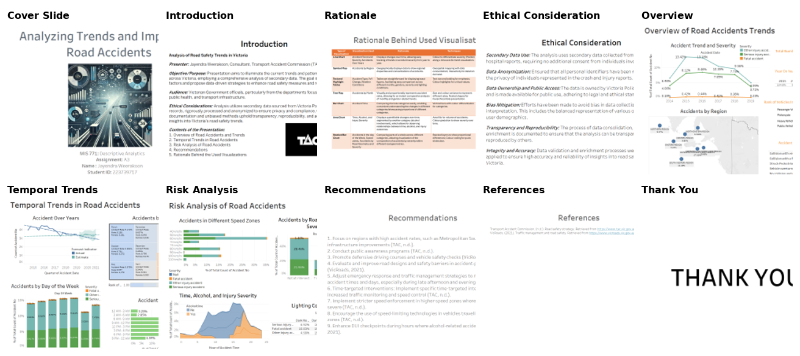
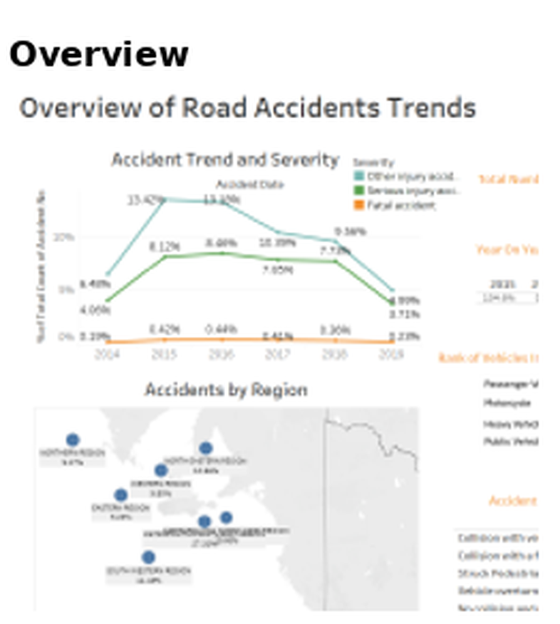
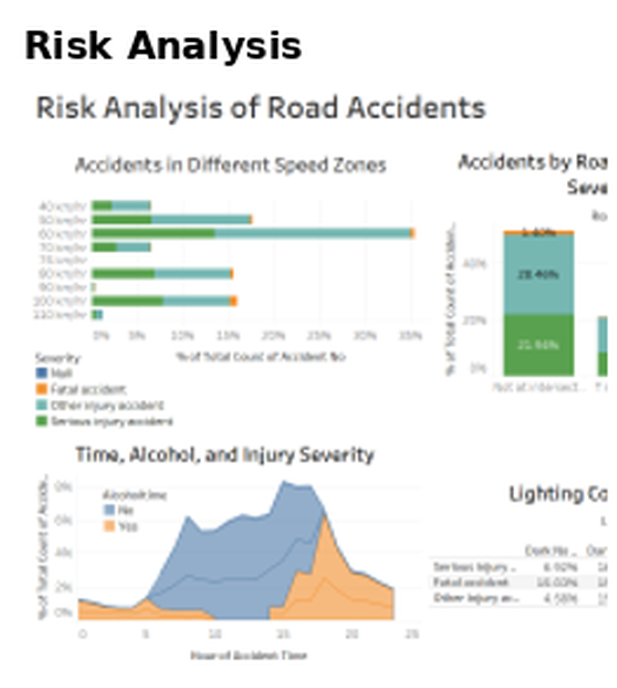

# Victorian Road Crash & Injury Analytics

Tableau analytics project turning consolidated Victorian road crash and hospital injury data (2014-2019) into an interactive Story, moving from high-level trends down to diagnostic detail on when, where and why crashes happen. Built from Victoria Police crash reports and hospital injury records; the underlying dataset isn't redistributed here, but the full dashboard is.

## Storyboard

  

## What the data shows

**Accident severity peaked in 2015-2016 and declined through to 2019**, with the "other injury" and "serious injury" categories tracking closely together across the period.

  

Geographically, the **Metropolitan region accounts for the largest single share of accidents (around 27%)**, consistent with it carrying the highest traffic volumes; South Eastern Region is the next largest contributor.

On risk conditions:

  

- **60 km/h zones account for the largest share of accidents of any speed zone** (around a third), well ahead of the 40, 80 and 100 km/h zones.
- Most accidents are **not** alcohol-related, but the alcohol-involved share **spikes sharply in the early evening** (roughly hour 18-20), overlapping with the day's general afternoon/evening peak in accident volume.

## Recommendations

Nine evidence-based recommendations came out of the analysis, spanning three themes:

- **Location & infrastructure**: prioritise high-accident regions for road design and safety-barrier improvements, without necessarily requiring new infrastructure spend.
- **Time-targeted enforcement**: increase traffic monitoring, speed control and DUI checkpoints around the identified late-afternoon/evening and alcohol-related peak windows.
- **Driver behaviour**: public awareness campaigns, defensive driving courses, vehicle safety checks, and speed-limiting technology in higher-risk zones.

## Approach

1. **Understand the data**: reviewed the consolidated crash and injury dataset across time, location, conditions, crash type and road-user dimensions.
2. **Explore patterns**: analysed each dimension, then looked for interactions between them (e.g. time x alcohol involvement x severity).
3. **Build the dashboards**: designed Tableau visualisations per analytical question, then combined them into linked dashboards.
4. **Structure the story**: connected dashboards via Tableau's Story feature: Overview to Pattern Identification to Diagnostic Exploration to Recommendations.
5. **Translate to recommendations**: converted visual findings into a consultant-style narrative aimed at road-safety decision-makers.

## Tools & techniques

`Tableau` `Descriptive Analytics` `Exploratory Data Analysis` `Temporal Analysis` `Geographic Analysis` `Data Storytelling` `Dashboard Development`

## Repository contents

- [`victorian-road-crash-analysis.twb`](victorian-road-crash-analysis.twb): the Tableau workbook (data source not included)
- `images/`: storyboard and panel views referenced above
